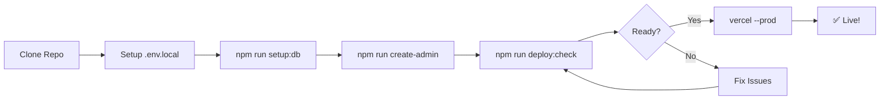

# 🎯 AEGIS Trading Coach - Deployment Summary

## ✅ What's Been Automated

Your AEGIS Trading Coach application is now fully prepared for automated deployment with the following features:

### 🚀 Automated Deployment Scripts

#### **Windows PowerShell** (`scripts/quick-deploy.ps1`)
- ✅ Pre-deployment checks
- ✅ Automatic commit of changes
- ✅ Build verification
- ✅ GitHub push
- ✅ One-click Vercel deployment

#### **Linux/Mac Bash** (`scripts/quick-deploy.sh`)
- ✅ Same features as PowerShell version
- ✅ Compatible with Unix systems

### 📋 Helper Scripts

| Script | Purpose | Command |
|--------|---------|---------|
| `setup-database.ts` | Auto-setup database schema | `npm run setup:db` |
| `create-admin.ts` | Create admin user | `npm run create-admin` |
| `deploy-check.ts` | Verify deployment readiness | `npm run deploy:check` |

### 🔧 Configuration Files

| File | Purpose |
|------|---------|
| `vercel.json` | Vercel deployment configuration |
| `.env.example` | Environment variables template |
| `.github/workflows/deploy.yml` | GitHub Actions CI/CD |

### 📚 Documentation

| Guide | What's Inside |
|-------|---------------|
| [QUICK_START.md](QUICK_START.md) | 3-command quick start |
| [DEPLOYMENT_GUIDE.md](DEPLOYMENT_GUIDE.md) | Complete deployment walkthrough |
| [SETUP_INSTRUCTIONS.md](SETUP_INSTRUCTIONS.md) | Detailed setup guide |
| [PROJECT_REBUILD_GUIDE.md](PROJECT_REBUILD_GUIDE.md) | Full rebuild documentation |

---

## 🎬 How to Deploy (Choose Your Path)

### 🌟 Path 1: Fully Automated (Recommended)

**For Windows:**
```powershell
.\scripts\quick-deploy.ps1
```

**For Linux/Mac:**
```bash
chmod +x scripts/quick-deploy.sh
./scripts/quick-deploy.sh
```

**What happens:**
1. Checks your setup ✅
2. Commits any changes 📝
3. Builds the project 🔨
4. Pushes to GitHub 📤
5. Deploys to Vercel 🚀

**Time: ~3 minutes**

---

### ⚡ Path 2: Quick Manual (3 Commands)

```bash
# 1. Setup database
npm run setup:db

# 2. Create admin
ADMIN_EMAIL="you@email.com" ADMIN_PASSWORD="Pass123!" npm run create-admin

# 3. Deploy
vercel --prod
```

**Time: ~5 minutes**

---

### 🛠️ Path 3: Full Manual Control

Follow the detailed guide in [DEPLOYMENT_GUIDE.md](DEPLOYMENT_GUIDE.md)

**Time: ~10 minutes**

---

## 📦 NPM Scripts Available

### Quick Actions
```bash
npm run setup:db        # Complete database setup
npm run create-admin    # Create admin user
npm run deploy:check    # Verify ready to deploy
npm run deploy:prepare  # Check + build
```

### Development
```bash
npm run dev            # Local development server
npm run build          # Production build
npm start              # Production server
```

### Database
```bash
npm run db:push        # Push schema changes
npm run db:studio      # Open Prisma Studio GUI
```

---

## 🔐 Environment Variables Needed

### Local Development (`.env.local`)
```env
PRISMA_ACCELERATE_URL="prisma+postgres://..."
NEXTAUTH_SECRET="your-secret"
NEXTAUTH_URL="http://localhost:3000"
```

### Production (Vercel Dashboard)
```env
PRISMA_ACCELERATE_URL="prisma+postgres://..."
NEXTAUTH_SECRET="same-as-local"
NEXTAUTH_URL="https://your-app.vercel.app"
```

**Get `PRISMA_ACCELERATE_URL`:**
1. Go to https://cloud.prisma.io
2. Create PostgreSQL database
3. Enable Accelerate
4. Copy connection string

**Generate `NEXTAUTH_SECRET`:**
```bash
node -e "console.log(require('crypto').randomBytes(32).toString('base64'))"
```

---

## ✨ What Makes This Special

### 🎯 One-Command Deployment
Instead of:
- Manually checking files
- Running multiple commands
- Remembering git workflows
- Configuring Vercel settings

You get:
- **Single script execution**
- **Automatic verification**
- **Error handling**
- **Step-by-step progress**

### 🔒 Safety Features

The deployment scripts include:
- ✅ Pre-deployment checks
- ✅ Build verification
- ✅ Git status verification
- ✅ Interactive prompts
- ✅ Error handling

### 📊 Deployment Checks

Running `npm run deploy:check` verifies:
- ✅ Environment template exists
- ✅ Required package scripts present
- ✅ Prisma schema exists
- ✅ NextAuth configured
- ✅ Middleware setup
- ✅ Git security (.gitignore)
- ✅ Vercel configuration

---

## 🚦 Deployment Workflow

### First Time Setup



### Subsequent Deployments

```bash
# Option 1: Automated
.\scripts\quick-deploy.ps1

# Option 2: Vercel CLI
vercel --prod

# Option 3: GitHub Push (with Actions)
git push origin main
```

---

## 🎓 Learning Resources

### For Beginners
1. Start with [QUICK_START.md](QUICK_START.md)
2. Follow the automated script
3. Explore the deployed app

### For Developers
1. Read [DEPLOYMENT_GUIDE.md](DEPLOYMENT_GUIDE.md)
2. Understand the scripts in `/scripts`
3. Customize as needed

### For DevOps
1. Review `.github/workflows/deploy.yml`
2. Configure GitHub Actions
3. Set up custom domains

---

## 📞 Getting Help

### Check These First
1. Run `npm run deploy:check`
2. Review error messages
3. Check Vercel logs

### Common Issues

**"Vercel command not found"**
```bash
npm install -g vercel
```

**"Database connection failed"**
- Verify `PRISMA_ACCELERATE_URL` is correct
- Check Prisma Cloud dashboard
- Ensure database is running

**"Build failed"**
```bash
rm -rf .next node_modules
npm install
npm run build
```

**"Can't create admin"**
```bash
npm run setup:db  # Reset database
npm run create-admin
```

---

## 🎉 Success Metrics

After deployment, you should have:

✅ **Application**
- Live URL on Vercel
- SSL certificate active
- All pages loading

✅ **Database**
- PostgreSQL running on Prisma Cloud
- Schema deployed
- Accelerate enabled

✅ **Authentication**
- Admin user created
- Login working
- Sessions persisting

✅ **Integration**
- API endpoints responding
- Health checks passing
- Ready for MT5 sync

---

## 🚀 Next Steps After Deployment

### 1. Test Your Deployment
```bash
# Health check
curl https://your-app.vercel.app/api/health

# EA health
curl https://your-app.vercel.app/api/ea-health
```

### 2. Configure MT5 Expert Advisor
- Copy `PropControlExporter.mq5` to MT5
- Set API_URL to your Vercel URL
- Enable WebRequest in MT5

### 3. Invite Users
- Share your app URL
- Users can sign up at `/auth/signup`
- Admin dashboard at `/dashboard`

### 4. Monitor Performance
- Check Vercel Analytics
- Review Prisma Cloud metrics
- Monitor API response times

---

## 🎊 Congratulations!

You now have:
- ✅ Fully automated deployment pipeline
- ✅ One-command deploy capability
- ✅ Comprehensive documentation
- ✅ Production-ready application
- ✅ CI/CD with GitHub Actions
- ✅ Professional monitoring

**Your AEGIS Trading Coach is ready for the world!** 🌍

---

## 📝 Quick Reference Card

### Deploy Commands
```bash
# Automated (Windows)
.\scripts\quick-deploy.ps1

# Automated (Linux/Mac)
./scripts/quick-deploy.sh

# Manual
npm run deploy:check && vercel --prod
```

### Database Commands
```bash
npm run setup:db      # Full setup
npm run db:push       # Push schema
npm run db:studio     # GUI
```

### Admin Commands
```bash
npm run create-admin  # Interactive
ADMIN_EMAIL="x@y.com" ADMIN_PASSWORD="Pass!" npm run create-admin
```

### Vercel Commands
```bash
vercel                # Preview deploy
vercel --prod        # Production deploy
vercel logs          # View logs
vercel env ls        # List env vars
```

---

**Ready to deploy?** Choose your path above and get started! 🚀
