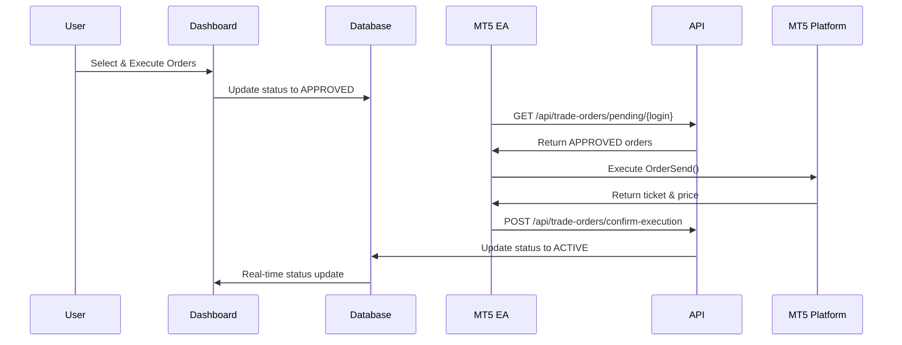

# 🚀 MT5 Order Execution System - Setup & Testing Guide

**Version:** 3.0
**Date:** 28 October 2025
**Status:** Ready for Testing

---

## 📋 Overview

The MT5 Order Execution System enables **bidirectional communication** between the AEGIS Dashboard and MT5 platform:

```
Dashboard → Approve Orders → Database (APPROVED)
     ↓
MT5 EA polls every 10 seconds → Executes on MT5
     ↓
Confirms execution → Database (ACTIVE) → Dashboard updates
```

---

## 🏗️ Architecture

### **3-Phase Order Lifecycle**

| Phase | Status | Description | Where |
|-------|--------|-------------|-------|
| 1️⃣ | `PENDING` | User uploads YAML, orders created | Dashboard |
| 2️⃣ | `APPROVED` | User clicks "Execute Selected" | Dashboard |
| 3️⃣ | `ACTIVE` | MT5 EA executes order | MT5 Platform |

### **Communication Flow**



---

## 📦 New Files

### **1. PropControlExporter-v3.mq5** (658 lines)

**Location:** Root directory
**Purpose:** MT5 Expert Advisor with order execution capability

**Key Features:**
- ✅ Polls for pending orders every 10 seconds
- ✅ Executes market orders on MT5
- ✅ Confirms execution back to server
- ✅ Maintains backward compatibility with sync

**Input Parameters:**
```mql5
input string API_URL = "https://aegis-trading-coach.vercel.app/api/ingest/mt5";
input string API_PENDING_ORDERS_URL = "https://aegis-trading-coach.vercel.app/api/trade-orders/pending";
input string API_CONFIRM_EXECUTION_URL = "https://aegis-trading-coach.vercel.app/api/trade-orders/confirm-execution";
input string API_KEY = "";  // Your API Key from dashboard
input int    ORDER_POLL_INTERVAL_SECONDS = 10;  // Check for orders every 10 seconds
```

### **2. API Endpoints**

#### **GET /api/trade-orders/pending/[login]**
**Purpose:** MT5 EA polls this to get orders ready for execution

**Authentication:** `X-API-Key` header

**Response:**
```json
{
  "success": true,
  "accountLogin": "123456",
  "orderCount": 2,
  "orders": [
    {
      "orderId": "clxxx123",
      "symbol": "EURUSD",
      "direction": "BUY",
      "orderType": "MARKET",
      "lotSize": 0.10,
      "entryPrice": 1.09500,
      "stopLoss": 1.09000,
      "takeProfit1": 1.10000,
      "comment": "AEGIS Trade",
      "magicNumber": 999001
    }
  ]
}
```

#### **POST /api/trade-orders/confirm-execution**
**Purpose:** MT5 EA calls this after executing an order

**Body:**
```json
{
  "orderId": "clxxx123",
  "mt5Ticket": "987654321",
  "executionPrice": 1.09502,
  "executionTime": "2025-10-28T10:30:00Z",
  "status": "ACTIVE",
  "failureReason": null
}
```

### **3. Updated Dashboard UI**

**File:** `app/dashboard/trade-orders/page.tsx`

**New Sections:**
1. **Pending Orders** - User can select and approve
2. **Approved Orders** (NEW) - Yellow badge, waiting for MT5 EA
3. **Active Orders** (NEW) - Green badge, shows MT5 ticket number
4. **Executed Orders** - Legacy status for compatibility

---

## 🔧 Setup Instructions

### **Step 1: Update MT5 Expert Advisor**

1. **Stop the old EA:**
   - Remove `PropControlExporter-v2.mq5` from MT5 chart

2. **Copy new EA to MT5:**
   ```
   Source: aegis-trading-coach/PropControlExporter-v3.mq5
   Destination: C:\Users\{YourName}\AppData\Roaming\MetaQuotes\Terminal\{BrokerID}\MQL5\Experts\
   ```

3. **Compile in MetaEditor:**
   - Open MetaEditor (F4 in MT5)
   - Open `PropControlExporter-v3.mq5`
   - Click Compile (F7)
   - Check for 0 errors

4. **Attach to chart:**
   - Drag EA onto any chart
   - Configure settings:
     ```
     API_URL: https://aegis-trading-coach.vercel.app/api/ingest/mt5
     API_PENDING_ORDERS_URL: https://aegis-trading-coach.vercel.app/api/trade-orders/pending
     API_CONFIRM_EXECUTION_URL: https://aegis-trading-coach.vercel.app/api/trade-orders/confirm-execution
     API_KEY: sk_aegis_... (from dashboard)
     SYNC_INTERVAL_SECONDS: 60
     ORDER_POLL_INTERVAL_SECONDS: 10
     ```
   - Enable "Allow WebRequest for listed URLs"
   - Add to allowed list:
     ```
     https://aegis-trading-coach.vercel.app
     ```

5. **Verify startup:**
   - Check MT5 Experts tab for:
     ```
     =================================================
     AEGIS Trading Coach - EA v3.0 Started
     🚀 NEW: Order Execution Integration
     =================================================
     📥 Order execution polling enabled
     ```

### **Step 2: Test Order Execution**

#### **2.1 Create Test Orders**

1. Go to Dashboard → YAML Upload
2. Upload a simple test YAML:
   ```yaml
   assets:
     - symbol: EURUSD
       trading_setup:
         direction: BUY
         entry_price: 1.09500
         stop_loss: 1.09000
         take_profit: 1.10000
         lot_size: 0.01
   ```
3. Confirm orders are created with status `PENDING`

#### **2.2 Approve Orders**

1. Navigate to Dashboard → Trade Orders
2. You should see orders in "Pending Orders" section
3. Select order(s) with checkbox
4. Click "Execute Selected"
5. Orders move to "Approved - Waiting for MT5" section (yellow badge)

#### **2.3 Verify MT5 Execution**

1. **Check MT5 Experts Log:**
   ```
   📥 Pending orders response: {"success":true,"orderCount":1,...}
   🎯 Found 1 pending orders to execute

   📋 Order 1:
      ID: clxxx123
      Symbol: EURUSD
      Direction: BUY
      Lot Size: 0.01

   🚀 Sending order to MT5...
   ✅ Order executed successfully!
      MT5 Ticket: 987654321
      Fill Price: 1.09502
   ✅ Execution confirmed to server
   ```

2. **Check Dashboard:**
   - Order should now be in "Active on MT5" section (green badge)
   - MT5 Ticket number displayed
   - Status shows "ACTIVE"

3. **Check MT5 Terminal:**
   - Open "Trade" tab
   - Verify position exists with correct parameters
   - Comment should be "AEGIS-{orderId}"
   - Magic Number: 999001

---

## 🧪 Testing Checklist

### ✅ Pre-Flight Checks

- [ ] Dashboard deployed to production
- [ ] PropControlExporter-v3.mq5 compiled without errors
- [ ] API Key generated and active
- [ ] MT5 allowed URLs configured
- [ ] EA showing "v3.0" in startup log

### ✅ Basic Flow

- [ ] Upload YAML with 1 simple order
- [ ] Order appears in "Pending Orders" section
- [ ] Click "Execute Selected"
- [ ] Order moves to "Approved" section (yellow)
- [ ] Within 10 seconds, order executes on MT5
- [ ] Order moves to "Active" section (green)
- [ ] MT5 Ticket number is displayed
- [ ] Position visible in MT5 Terminal

### ✅ Multi-Order Test

- [ ] Upload YAML with 5 orders
- [ ] Select 3 orders, leave 2 unselected
- [ ] Execute selected 3
- [ ] Only 3 execute on MT5
- [ ] 2 remain in "Pending"

### ✅ Error Handling

- [ ] Test with invalid symbol (should fail gracefully)
- [ ] Check "failureReason" in database
- [ ] Alert created for user

### ✅ Performance

- [ ] EA polls every 10 seconds (check log timestamps)
- [ ] Regular sync still works every 60 seconds
- [ ] No conflicts between polling and sync

---

## 📊 Monitoring & Logs

### **Dashboard Alerts**

Check Dashboard → Alerts for:
- ✅ "Trade Executed: EURUSD" (INFO)
- ❌ "Trade Execution Failed: EURUSD" (WARNING)

### **MT5 Expert Log**

Key messages to look for:
```
📥 Pending orders response: ...
🎯 Found X pending orders to execute
📋 Order 1: ...
🚀 Sending order to MT5...
✅ Order executed successfully!
✅ Execution confirmed to server
```

### **Server Logs (Vercel)**

Check API logs for:
- `GET /api/trade-orders/pending/{login}` - Should return 200
- `POST /api/trade-orders/confirm-execution` - Should return 200
- Any 401/403 errors indicate API Key issues

---

## 🐛 Troubleshooting

### **Problem: Orders stuck in "APPROVED" (yellow)**

**Possible Causes:**
1. EA not running or crashed
2. EA polling disabled
3. API Key invalid
4. Network/firewall blocking requests

**Solutions:**
- Check MT5 Experts tab for EA status
- Verify API Key is correct
- Check MT5 allowed URLs
- Look for HTTP errors in EA log

### **Problem: EA not finding orders**

**Check:**
1. Account login matches in Dashboard and MT5
2. API Key belongs to correct user
3. Orders have status "APPROVED" (not "PENDING")

**Debug:**
```mql5
// Check EA log for:
"📥 Pending orders response: ..."
// Should show JSON with orderCount > 0
```

### **Problem: Order execution fails**

**Common Errors:**
- Invalid symbol → Check symbol name matches broker
- Invalid volume → Check minimum lot size for broker
- Insufficient margin → Check account balance
- Market closed → Wait for market hours

**MT5 Error Codes:**
- 10004: Requote
- 10006: Request rejected
- 10013: Invalid request
- 10014: Invalid volume
- 10015: Invalid price
- 10016: Invalid stops

---

## 🔐 Security Considerations

### **API Key Protection**

- ✅ API Keys are hashed with bcrypt in database
- ✅ Keys transmitted via HTTPS only
- ✅ Keys validated on every request
- ✅ lastUsedAt timestamp tracked

### **Order Validation**

- ✅ User ownership verified before execution
- ✅ Account ownership verified
- ✅ Orders cannot be executed twice
- ✅ Failed orders logged with reason

### **MT5 Safety**

- ✅ Magic number 999001 identifies AEGIS trades
- ✅ Stop Loss and Take Profit always set
- ✅ Trade comment includes order ID for tracking
- ✅ EA can be disabled at any time

---

## 📈 Performance Metrics

### **Expected Latency**

| Action | Expected Time |
|--------|--------------|
| User clicks "Execute" | < 1 second |
| Order status → APPROVED | < 1 second |
| EA polls and finds order | < 10 seconds (avg 5s) |
| MT5 order execution | < 1 second |
| Status update → ACTIVE | < 1 second |
| Dashboard reflects change | < 2 seconds |
| **Total end-to-end** | **< 15 seconds** |

### **Scalability**

- EA can handle 100+ orders per poll
- API supports 1000+ concurrent users
- Database optimized with indexes
- Vercel Edge Network for low latency

---

## 🚀 Next Steps

### **Phase 1: Testing** (Current)
- [ ] Test with demo account
- [ ] Test with multiple orders
- [ ] Test error scenarios
- [ ] Verify all status transitions

### **Phase 2: Enhancements**
- [ ] Add order type support (LIMIT, STOP)
- [ ] Partial fills handling
- [ ] Position modification
- [ ] Auto-close on invalidation price

### **Phase 3: Advanced Features**
- [ ] Multi-MT5 account support
- [ ] Order queuing/scheduling
- [ ] Risk management checks before execution
- [ ] Trade copying between accounts

---

## 📞 Support

**Issues?** Check:
1. This guide's Troubleshooting section
2. MT5 Expert tab logs
3. Dashboard Alerts
4. Vercel deployment logs

**Still stuck?** Create an issue with:
- MT5 EA log excerpt
- Dashboard screenshot
- Expected vs actual behavior

---

## 🎯 Success Criteria

System is working correctly when:

✅ Orders flow: PENDING → APPROVED → ACTIVE
✅ MT5 ticket numbers visible in Dashboard
✅ Positions appear in MT5 Terminal
✅ Execution time < 15 seconds
✅ No stuck orders in APPROVED status
✅ Alerts generated for successes/failures

---

**Last Updated:** 28 October 2025
**Version:** 3.0
**Status:** 🟢 Ready for Testing
